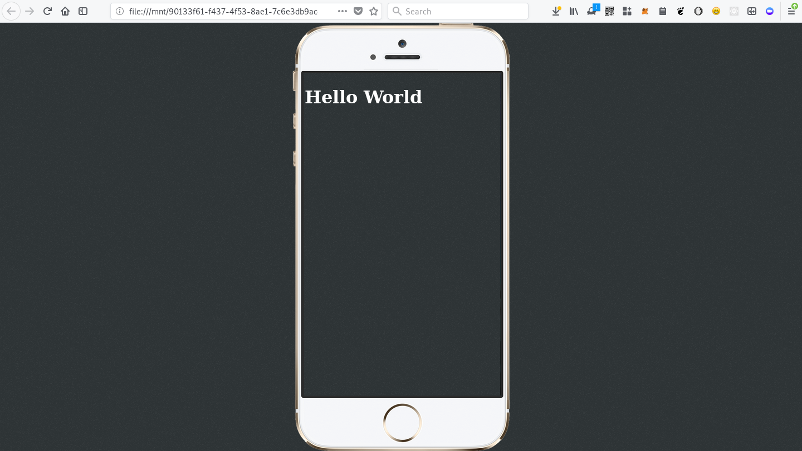

# Mobile Only Web
Never build a different version of your web app for laptop users. It's no longer a mobile first world. It is mobile only.

# Device aware rendering
Renders the website inside a mobile frame when opened on a laptop

## Demo on laptops


## Demo on mobiles 


# Easy integration
```
<script src="https://ajax.googleapis.com/ajax/libs/jquery/3.3.1/jquery.min.js"></script>
<script src="mobileonly.js"></script>
```

And put your HTML inside a div with ID `main`

```
<div id='main'>
   ... Your content here ...
</div>
```


